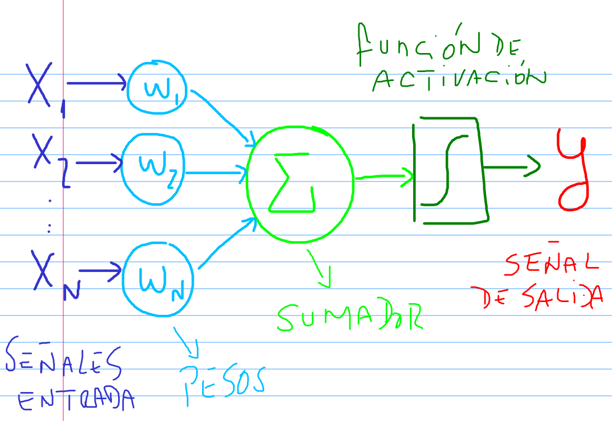
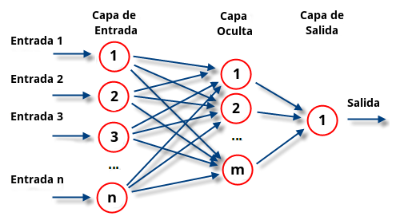

# Redes Neuronales (NN)

Las redes neuronales se han vuelto populares para el modelado de problemas altamente no lineales a partir de datos y como interpoladores en general. En estos temas hablaremos sobre los constituyentes de las redes neuronales.

## El perceptrón

El perceptrón es una abstracción del modelo más simple de una neurona. El perceptrón es una unidad que recibe una cierta cantidad de señales de entradas, y luego de cierto procesamiento entrega una señal de salida.
En la Figura 1 se muestra un esquema de un perceptrón

El esquema anterior se puede expresar matemáticamente como
$$
y = f\left( \sum_{i=1}^N{w_i x_i} \right),
$$
o de manera más compacta
$$
y = f\left( \mathbf{w}\cdot\mathbf{x} \right),
$$
donde mamos $\mathbf{x} = (x_1,...x_N)$ es el conjunto de señales (o variables o features) de entrada. El conjunto de parámetros asociados a cada variable será $\mathbf{w} = (w_1,...w_N)$, y a la función $f$ se la denomina función de activación.

### La función de activación $f$
Si se observa detenidamente, cuando la función de activación es $y=x$, es decir la identidad, lo que se tiene es la típica expresión de la regresión lineal multivariada ya que $y = w_1 x_1 + ...+ w_N x_N$. Por otra parte se puede ver que la expresión anterior no muestra de manera explícita la ordenada al origen (o bias). Esto se soluciona de manera simple agregando una variable constante igual a la unidad, por ejemplo una variable $x_{N+1} = 1$, de modo tal que $y = w_1 x_1 + ...+ w_N x_N + w_{N+1}$. Para el caso de una sola señal de entrada, se tiene la típica regresión lineal previamente vista.

Por otra parte, se pueden adoptar todo tipo de funciones de activación, en particular suelen ser muy útiles las funciones sigmoides para problemas diversos, pero fundamentalmente para problemas de clasificación.

## El perceptron multicapa

La gran utilidad del perceptrón es que se puede combinar con otros perceptrones formando capas. Esta combinación o apilamiento da lugar a una rama del aprendizaje automatizado denominado __deep learning__. Resulta muy importante notar que el apilamiento de muchas capas de perceptrones o simplemente neuronas, con funciones de activacion altamente no lineales da lugar a interpoladores altamente no lineales, lo que hace que sea una herramienta muy poderosa para el análisis de datos en general. También es importante remarcar que un perceptrón multicapa puede diferenciarse mediante la regla de la cadena de manera relativamente sencilla, permitiendo aplicar algoritmos de descenso por gradiente y todas sus variantes. Para una descripción somera se puede visitar este artículo de [Wikipedia](https://es.wikipedia.org/wiki/Perceptr%C3%B3n_multicapa).

En la Figura 2 (extraída del artículo citado de Wikipedia) se muestra un esquema de red neuronal con una capa oculta.

En términos formales, para las $n$ entradas, se tendrán $n+1$ parámetros multiplicando de modo que la salida de la $j-esima$ neurona será
$$
y'_j = h_j(\mathbf{w}\cdot\mathbf{x}).
$$

En la capa siguiente (capa oculta) tendremos un nuevo conjunto de parámetros $w'$, de modo tal que la salida final será la función compuesta
$$
y = g(\mathbf{w'}\cdot\mathbf{y'}) =g(\mathbf{w'}\cdot\mathbf{h}(\mathbf{w}\cdot\mathbf{x})).
$$

Donde la coposición de funciones es evidente y la derivada de $y$ respecto de las variables de entrada se pueden hallar mediante la regla de la cadena como ya se ha dicho.